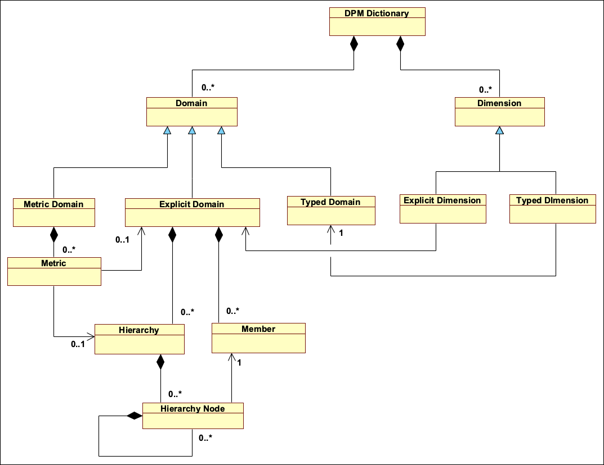
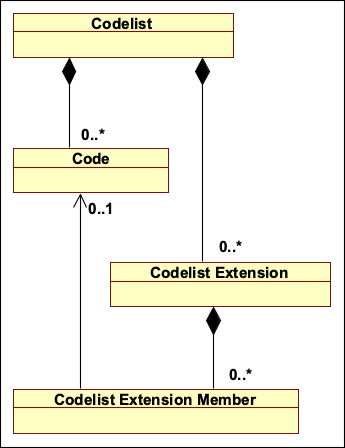
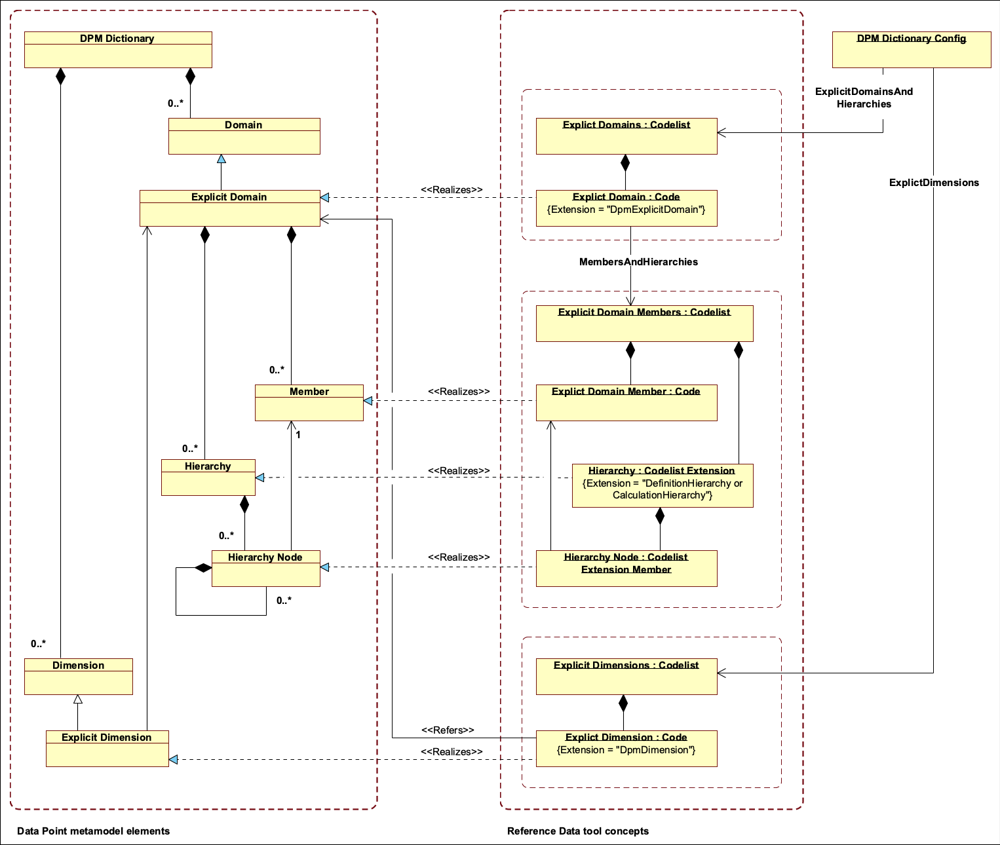
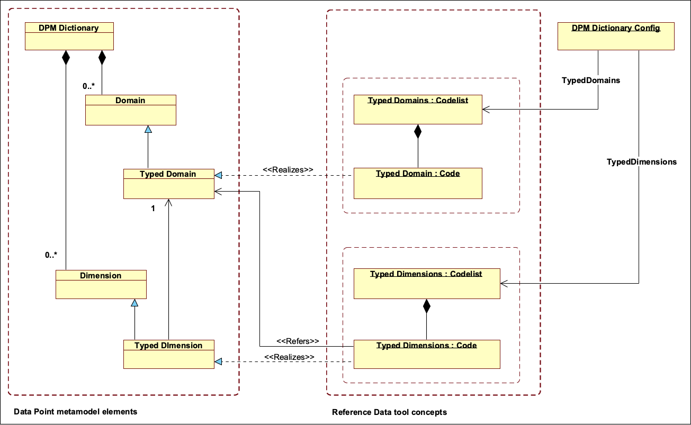
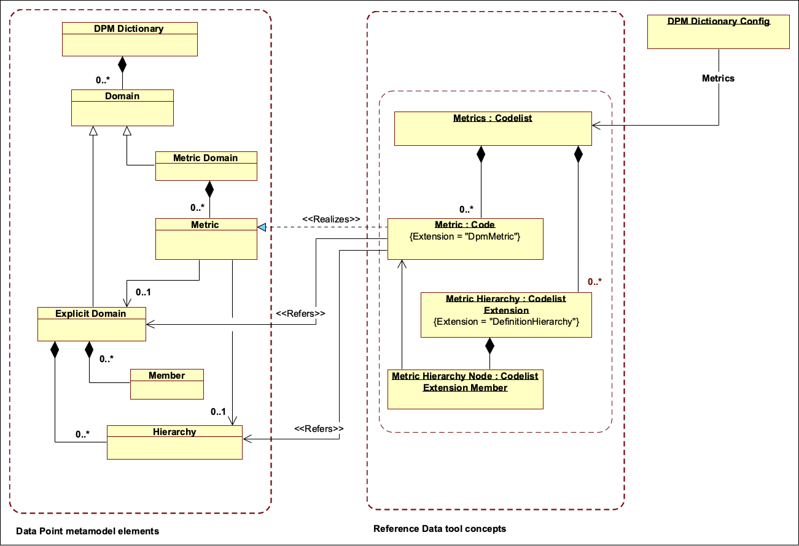

# Mapping between Data Point metamodel and Reference Data tool data model

 

## 1. Overview

This document describes mapping between elements in Data Point metamodel and concepts in the Reference Data tool's logical data model. In practice, this document defines how Data Point Model data can be arranged in the Reference Data tool, so that Data Point Model's specific data storage, structure and management needs are full filled by the features of the generic Reference Data tool. Note that here specified mapping covers only DPM Dictionary contents (i.e. Data Point Model's business concept dictionary). DPM Framework contents (i.e. Data Point Model's reporting requirements) are not covered by this mapping and thus they must be managed externally. 

The overall goal of this mapping and related tooling is to enable management of DPM Dictionary contents on the Reference Data tool. Thus, separated Data Point Model specific management system would not be needed for basic DPM Dictionary related use cases. For example, interested stakeholders can then view and access DPM Dictionary information through the various user interfaces and APIs provided by the Reference Data tool. 

However, specific Data Point Model management system is needed for more advanced use-cases. These use-cases include for example management of DPM Frameworks content and generation of technology specific representations (like XBRL taxonomies) from Data Point Models. To enable the co-operation between the Reference Data tool and Data Point Model management system there is used programmatical solution to integrate Data Point Model management system to Reference Data tool. Integration solution follows here presented mapping rules to transpose data between Data Point and Reference Data realms.

  

### 1.1 Revision history

| Revision | Date       | Author(s) | Description                                  |
| -------- | ---------- | --------- | -------------------------------------------- |
| 0.1      | 2018-11-27 | HE        | Initial markdown-based mapping specification |
| 0.2      | 2019-01-21 | HE        | Updates to Metrics related mappings          |
| 0.3      | 2019-03-21 | HE        | Holistic overhaul of the document            |

  

### 1.2 Abbreviations

| Term | Description                            |
| ---- | -------------------------------------- |
| API  | Application Programming Interface      |
| DPM  | Data Point Model                       |
| XBRL | eXtensible Business Reporting Language |

  

### 1.3 Glossary of terms

| Term                                  | Description                                                  |
| ------------------------------------- | ------------------------------------------------------------ |
| Data Point metamodel                  | The Data Point metamodel defines components and modelling principles used in the construction of concrete Data Point Models. |
| Data Point Model                      | Data Point Model is a a result of Data Point Modelling process. Data Point Model contains information describing the characteristics of the information exchanged in the certain business reporting context. Data Point Model contains a dictionary of business concepts and their properties (DPM dictionary). Data Point Model defines also reporting requirements for a specific reporting scope (DPM framework). |
| Data Point Modelling                  | Data Point Modelling is a data-oriented methodology for developing semantic and multi-dimensional models that describe business reporting requirements. Semantic model enable communication between reporting process stakeholders, like business reporting experts which are familiar with the reporting domain and IT & software specialists which produce tooling and solutions for the reporting. |
| DPM Dictionary                        | DPM Dictionary defines the information classifications used in certain reporting scope. |
| DPM Framework                         | DPM Framework contains reporting requirements for a specific reporting scope. |
| The Finnish Interoperability Platform | The Finnish Interoperability Platform (https://yhteentoimiva.suomi.fi/fi/) is a technical solution for producing and managing the information metadata (i.e. information about information) for the Finnish public sector. The Interoperability Platform consists from multiple tools targeted for different metadata needs. Along the technical platform, there is also a dedicated methodological framework (The Interoperability Method)  for coordinating the content creation and management on the platform. |
| The Reference Data tool               | The Reference Data tool (https://koodistot.suomi.fi/) is one of the tools within the Interoperability Platform. The Reference Data tool is used to manage code sets and their metadata. The Reference Data tool supports for example different ways to organize code sets (hierarchical and flat code lists, linked code set trees), managing code sets lifecycle (content status tags and adjacent versions with altered content) and use-case specific customizations (extension attributes and hierarchy types). |
| The TaxGen tool                       | The TaxGen tool is a utility to programmatically generate Data Point Models from data stored in the Reference Data tool. The TaxGen tool reads data from the Reference Data tool and transposes data to Data Point Model according the mapping rules presented in this document. |

 

## 2. Mapping context 

### 2.1 Data Point metamodel

There isn't single unified and globally accepted Data Point metamodel, but metamodel variates between the solutions used to aid in the Data Point Modelling. For example the European Banking Authority's version from Data Point metamodel is presented in "Abstract description of the model represented in taxonomies following the DPM approach" -document (http://www.eurofiling.info/finrepTaxonomy/DPM-Formal-Model.pdf ). 

This mapping specification uses Data Point metamodel presented in the diagram 1. The used metamodel is an adaptation from EBA's Data Point metamodel and covers currently only DPM Dictionary related parts. 

 

<figure>
  
  <figcaption><em>Diagram 1:</em> Data Point metamodel's DPM Dictionary part.</figcaption>
</figure>

 

### 2.2. Reference Data tool's logical data model 

The Reference Data tool's logical data model shown in the diagram 2. The diagram shows just the parts which are relevant for this mapping specification, more complete Reference Data tool's logical data model can be found from The Finnish Interoperability Platform itself: http://uri.suomi.fi/datamodel/ns/code. Also, the platform's documentation covers Reference Data tool: https://vrk-ewiki.eden.csc.fi/display/YTIJD .

 

<figure>
  
  <figcaption><em>Diagram 2:</em> Reference Data tool's logical data model.</figcaption>
</figure>

  

## 3. The mapping specification

In following is specified correspondence between elements in Data Point metamodel and concepts supported by the Reference Data tool. For clarity, mapping is divided to following sections:  

- DPM Dictionary explicit elements: defines mapping for Explicit Domains, Domain Members, Hierarchies, Hierarchy Nodes and Explicit Dimensions.
- DPM Dictionary typed elements: defines mapping for Typed Domains and Typed Dimensions  
- DPM Dictionary metric elements: defines mapping for Metrics and also describes static Metric Domain and Metric Dimension.

  

### 3.1 Mapping of DPM explicit elements

In this section is described how Explicit Domains, Explicit Dimensions and their sub-elements are mapped to concepts available on Reference Data tool. The diagram 3. shows overview of the mapping.

 

<figure>
  
  <figcaption><em>Diagram 3:</em> Mapping of DPM Dictionary explicit elements.</figcaption>
</figure>

  

#### 3.1.1 Explicit Domain

##### Explicit Domain: structural mapping

| DPM element                       | Corresponding Reference Data concept                         |
| --------------------------------- | ------------------------------------------------------------ |
| Single Explicit Domain            | Extended Code with type: `DpmExplicitDomain`                 |
| Complete list of Explicit Domains | Single Codelist listing all Explicit Domains. Codelist is referred as `ExplicitDomainsAndHierarchies` in DPM Dictionary config. |

  

##### Explicit Domain: attribute mapping

| DPM attribute         | Data type   | Corresponding Reference Data value                           | Notes                                                        |
| --------------------- | ----------- | ------------------------------------------------------------ | ------------------------------------------------------------ |
| DomainCode            | String      | Code.CodeValue                                               |                                                              |
| DomainXBRLCode        | String      | "{Owner.Prefix}_exp:{DomainCode}"                            |                                                              |
| DomainLabel           | String      | Code.PrefLabel                                               |                                                              |
| DomainDescription     | String      | Code.Description                                             |                                                              |
| DataType              | String      | Fixed: `NULL`                                                |                                                              |
| IsTypedDomain         | Boolean     | Fixed: `FALSE`                                               |                                                              |
| Concept               | Object      | Code.Metadata                                                | Timestamps, validity dates, etc                              |
| MembersAndHierarchies | Association | Code.SubCodeCodelist                                         | Association to Yti Codelist providing Members and Hierarchies for Explicit Domain |
| MemberXBRLCodePrefix  | String      | Code.ExtensionOf(`DpmExplicitDomain`).ValueOf (`DpmMemberXBRLCodePrefix`) | Optional prefix for Explicit Domain's Members XBRL codes     |

  

##### Explicit Domain: Reference Data extensions

| Reference Data tool extension | Context             | Notes                                                        |
| ----------------------------- | ------------------- | ------------------------------------------------------------ |
| `DpmExplicitDomain`           | Code Extension      | Custom attributes: `DpmMemberXBRLCodePrefix`                 |
| `DpmMemberXBRLCodePrefix`     | Extension Attribute | Data type: String, Allowed values: Valid XML element name or empty |

  

#### 3.1.2 Explicit Domain Member

##### Explicit Domain Member: structural mapping
| DPM element                                         | Corresponding Reference Data concept                         |
| --------------------------------------------------- | ------------------------------------------------------------ |
| Single Explicit Domain Member                       | Code                                                         |
| Complete list of Members for single Explicit Domain | Single Codelist which is associated as SubCodeCodelist to the Code presenting the Explicit Domain. (See section 3.1.1 Explicit Domain) |

  

##### Explicit Domain Member: attribute mapping

| DPM attribute   | Data type   | Corresponding Reference Data value                | Notes                                                        |
| --------------- | ----------- | ------------------------------------------------- | ------------------------------------------------------------ |
| Domain          | Association | Derived from SubCodeCodelist association          | Domain this Memeber belongs to.                              |
| MemberCode      | String      | Code.CodeValue                                    | Value optionally prefixed with parent Explicit Domain's MemberXBRLCodePrefix |
| MemberXBRLCode  | String      | "{Owner.prefix}_{Domain.DomainCode}:{MemberCode}" |                                                              |
| MemberLabel     | String      | Code.PrefLabel                                    |                                                              |
| IsDefaultMember | Boolean     | Codelist.DefaultCode                              |                                                              |
| Concept         | Object      | Code.Metadata                                     | Timestamps, validity dates, etc                              |

  

#### 3.1.3 Hierarchy

##### Hierarchy: structural mapping
| DPM element                                             | Corresponding Reference Data concept                         |
| ------------------------------------------------------- | ------------------------------------------------------------ |
| Single Hierarchy                                        | Codelist Extension of type: `DefinitionHierarchy` or `CalculationHierarchy` |
| Complete list of Hierarchies for single Explicit Domain | All proper type Codelist Extensions in the Codelist which is associated as SubCodeCodelist to the Code presenting the Explicit Domain. (See section 3.1.1 Explicit Domain) |

  

##### Hierarchy: attribute mapping

| DPM attribute        | Data type   | Corresponding Reference Data value       | Notes                            |
| -------------------- | ----------- | ---------------------------------------- | -------------------------------- |
| Domain               | Association | Derived from SubCodeCodelist association | Domain this Hierarchy belongs to |
| HierarchyCode        | String      | CodelistExtension.CodeValue              |                                  |
| HierarchyLabel       | String      | CodelistExtension.PrefLabel              |                                  |
| HierarchyDescription | String      | Fixed: `NULL`                            |                                  |
| Concept              | Object      | CodelistExtension.Metadata               | Timestamps, validity dates, etc  |

  

##### Hierarchy: Reference Data extensions

| Reference Data tool extension | Context             | Notes                                                        |
| ----------------------------- | ------------------- | ------------------------------------------------------------ |
| `definitionHierarchy`         | Codelist Extension  | No custom attributes                                         |
| `calculationHierarchy`        | Codelist Extension  | Custom attributes: `ComparisonOperator` and `UnaryOperator`  |
| `ComparisonOperator`          | Extension Attribute | Data type: String, allowed values: `=`, `<=`, `>=`, `<`, `>`, empty |
| `UnaryOperator`               | Extension Attribute | Data type: String, allowed values: `+`, `-`, empty           |

  

#### 3.1.4 Hierarchy Node

##### Hierarchy Node: structural mapping
| DPM element                                           | Corresponding Reference Data concept                         |
| ----------------------------------------------------- | ------------------------------------------------------------ |
| Single Hierarchy Node                                 | Codelist Extension Member                                    |
| Complete list of Hierarchy Nodes for single Hierarchy | Codelist Extension Members which are present in the Codelist Extension |

  

##### Hierarchy Node: attribute mapping

| DPM attribute      | Data type   | Corresponding Reference Data value                         | Notes                                                        |
| ------------------ | ----------- | ---------------------------------------------------------- | ------------------------------------------------------------ |
| Hierarchy          | Association | CodelistExtensionMember.ParentCodelistExtension()          | Hierarchy to which this Node belongs.                        |
| Member             | Association | CodelistExtensionMember.Code                               | Member this node represents                                  |
| ParentMember       | Association | CodelistExtensionMember.HierarchyParent().Code             | Parent Member in hierarchy, `NULL` for root level nodes      |
| IsAbstract         | Boolean     | Fixed: `FALSE`                                             |                                                              |
| ComparisonOperator | String      | CodelistExtensionMember. MemberValue(`ComparisonOperator`) |                                                              |
| UnaryOperator      | String      | CodelistExtensionMember.MemberValue(`UnaryOperator`)       |                                                              |
| Order              | String      | Computed                                                   | Computed from the order of the Codelist Extension Members within Codelist Extension |
| Level              | String      | Computed                                                   | Computed from the hierarchical relation of the Codelist Extension Members within Codelist Extension |
| Path               | String      | Fixed: `NULL`                                              |                                                              |
| Concept            | Object      | CodelistExtensionMember.Metadata                           | Timestamps, validity dates, etc                              |

  

#### 3.1.5 Explicit Dimension

##### Explicit Dimension: Structural mapping
| DPM element                          | Corresponding Reference Data concept                         |
| ------------------------------------ | ------------------------------------------------------------ |
| Single Explicit Dimension            | Extended Code with type: `DpmDimension`                      |
| Complete list of Explicit Dimensions | Single Codelist listing all Explicit Domains. Codelist is referred as `Explicit imensions` in DPM Dictionary config. |

  

##### Explicit Dimension: Attribute mapping

| DPM attribute        | Data type   | Corresponding Reference Data value                           | Notes                                                        |
| -------------------- | ----------- | ------------------------------------------------------------ | ------------------------------------------------------------ |
| DimensionCode        | String      | Code.CodeValue                                               |                                                              |
| DimensionXBRLCode    | String      | "{Owner.prefix}_dim:{DimensionCode}"                         |                                                              |
| DimensionLabel       | String      | Code.PrefLabel                                               |                                                              |
| DimensionDescription | String      | Code.Description                                             |                                                              |
| IsTypedDimension     | Boolean     | Fixed: `FALSE`                                               |                                                              |
| Concept              | Object      | Code.Metadata                                                | Timestamps, validity dates, etc                              |
| Domain               | Association | Code.ExtensionOf(`DpmDimension`).ValueOf (`DpmDomainReference`) | Refers to Explicit Domain from which the allowable values for this Explicit Dimension are taken |

  

##### Explicit Dimension: Reference Data extensions

| Reference Data tool extension | Context             | Notes                                                        |
| ----------------------------- | ------------------- | ------------------------------------------------------------ |
| `DpmDimension`                | Code Extension      | Custom attributes: `DpmDomainReference`                      |
| `DpmDomainReference`          | Extension Attribute | Data type: String, Allowed values: domain code text or empty |

  

### 3.2 Mapping of DPM typed elements 

This section covers mapping of DPM Dictionary's typed elements (Typed Domains and Typed Dimensions) to Reference Data tools concepts. The diagram 3. shows overview of the mapping.

 

<figure>
  
  <figcaption><em>Diagram 4:</em> Mapping of DPM Dictionary typed elements.</figcaption>
</figure>

  

#### 3.2.1 Typed Domain

##### Typed Domain: structural mapping
| DPM element                    | Corresponding Reference Data concept                         |
| ------------------------------ | ------------------------------------------------------------ |
| Single Typed Domain            | Extended Code with type: `DpmTypedDomain`                    |
| Complete list of Typed Domains | Single Codelist listing all Typed Domains, Codelist is referred as `TypedDomains` in DPM Dictionary config |

  

##### Typed Domain: attribute mapping

| DPM attribute     | Data type | Corresponding Reference Data value                           | Notes                           |
| ----------------- | --------- | ------------------------------------------------------------ | ------------------------------- |
| DomainCode        | String    | Code.CodeValue                                               |                                 |
| DomainXBRLCode    | String    | "{Owner.prefix}_typ:{DomainCode}"                            |                                 |
| DomainLabel       | String    | Code.PrefLabel                                               |                                 |
| DomainDescription | String    | Code.Description                                             |                                 |
| DataType          | String    | Code.ExtensionOf(`DpmTypedDomain`).ValueOf (`DpmDomainDataType`) |                                 |
| IsTypedDomain     | Boolean   | Fixed: `TRUE`                                                |                                 |
| Concept           | Object    | Code.Metadata                                                | Timestamps, validity dates, etc |

  

##### Typed Domain: Reference Data extensions

| Reference Data tool extension | Context             | Notes                                                        |
| ----------------------------- | ------------------- | ------------------------------------------------------------ |
| `DpmTypedDomain`              | Code Extension      | Custom attributes: `DpmDomainDataType`                       |
| `DpmDomainDataType`           | Extension Attribute | Data type: String, allowed values: `Boolean`, `Date`, `Integer`, `Monetary`, `Percentage`, `String`, `Decimal`, `Lei`, `Isin`, empty |

  

#### 3.2.2 Typed Dimension

##### Typed Dimension: structural mapping
| DPM element                       | Corresponding Reference Data concept                         |
| --------------------------------- | ------------------------------------------------------------ |
| Single Typed Dimension            | Extended Code with type: `DpmDimension`                      |
| Complete list of Typed Dimensions | Single Codelist listing all Typed Domains, Codelist is referred as `TypedDimensions` in DPM Dictionary config. |

  

##### Typed Dimension: attribute mapping

| DPM attribute        | Data type   | Corresponding Reference Data value                           | Notes                                                        |
| -------------------- | ----------- | ------------------------------------------------------------ | ------------------------------------------------------------ |
| DimensionCode        | String      | Code.CodeValue                                               |                                                              |
| DimensionXBRLCode    | String      | "{Owner.prefix}_dim:{DimensionCode}"                         |                                                              |
| DimensionLabel       | String      | Code.PrefLabel                                               |                                                              |
| DimensionDescription | String      | Code.Description                                             |                                                              |
| IsTypedDimension     | Boolean     | Fixed: `TRUE`                                                |                                                              |
| Concept              | Object      | Code.Metadata                                                | Timestamps, validity dates, etc                              |
| Domain               | Association | Code.ExtensionOf(`DpmDimension`).ValueOf (`DpmDomainReference`) | Refers to Typed Domain from which the allowable values for this Typed Dimension are taken |

  

##### Explicit Dimension: Reference Data extensions

| Reference Data tool extension | Context             | Notes                                                        |
| ----------------------------- | ------------------- | ------------------------------------------------------------ |
| `DpmDimension`                | Code Extension      | Custom attributes: `DpmDomainReference`                      |
| `DpmDomainReference`          | Extension Attribute | Data type: String, Allowed values: domain code text or empty |

  

### 3.3 Mapping of DPM metric elements

This section covers mapping of DPM Dictionary's metric elements (Metric Domain, Metrics and related structures) to Reference Data tools concepts. The diagram 5. shows overview of the mapping.

 

<figure>
  
  <figcaption><em>Diagram 5:</em> Mapping of DPM Dictionary metric elements.</figcaption>
</figure>

  

#### 3.3.1 Metric Domain

##### Metric Domain: structural mapping
| DPM element    | Corresponding Reference Data concept                         |
| -------------- | ------------------------------------------------------------ |
| Metrics Domain | Parent Domain for Metrics. It exists as predefined in DPM models and has always code `MET`. |

  

#### 3.3.2 Metric

##### Metric: structural mapping
| DPM element              | Corresponding Reference Data concept                         |
| ------------------------ | ------------------------------------------------------------ |
| Single Metric            | Extended Code with type: `DpmMetric`                         |
| Complete list of Metrics | Single Codelist listing all Metrics, Codelist is referred as `Metrics` in DPM Dictionary config. |

  

##### Metric: attribute mapping

| DPM attribute            | Data type   | Corresponding Reference Data value                           | Notes                                                        |
| ------------------------ | ----------- | ------------------------------------------------------------ | ------------------------------------------------------------ |
| Domain                   | Association | Fixed: Metrics Domain (`MET`)                                |                                                              |
| MemberCode               | String      | "{DataType.TypeMarker()}{PeriodType.TypeMarker()}​{MetricNumber}" |                                                              |
| MemberXBRLCode           | String      | "{Owner.Prefix}_met:{MemberCode}                             |                                                              |
| MemberLabel              | String      | Code.PrefLabel                                               |                                                              |
| IsDefaultMember          | Boolean     | Fixed: `NULL`                                                |                                                              |
| Concept                  | Object      | Code.Metadata                                                | Timestamps, validity dates, etc                              |
| MetricNumber             | Integer     | Code.CodeValue                                               |                                                              |
| DataType                 | String      | Code.ExtensionOf(`DpmMetric`).ValueOf (`DpmMetricDataType`)  |                                                              |
| FlowType                 | String      | Code.ExtensionOf(`DpmMetric`).ValueOf (`DpmFlowType`)        |                                                              |
| BalanceType              | String      | Code.ExtensionOf(`DpmMetric`).ValueOf (`DpmBalanceType`)     |                                                              |
| ReferencedDomainCode     | String      | Code.ExtensionOf(`DpmMetric`).ValueOf (`DpmDomainReference`) | Associates metric with Domain, from where allowed values for this Metric are obtained |
| ReferencedHierarchyCode  | String      | Code.ExtensionOf(`DpmMetric`).ValueOf (`DpmHierarchyReference`) | Associates metric with Hierarchy, from where allowed values for this Metric are obtained |
| HierarchyStartingNode    | String      | Fixed: `NULL`                                                |                                                              |
| IsStartingMemberIncluded | Boolean     | Fixed: `NULL`                                                |                                                              |

  

##### Metric: Reference Data extensions

| Reference Data tool extension | Context             | Notes                                                        |
| ----------------------------- | ------------------- | ------------------------------------------------------------ |
| `DpmMetric`                   | Code Extension      | Custom attributes: `DpmMetricDataType`, `DpmFlowType`, `DpmBalanceType`,  `DpmDomainReference`, `DpmHierarchyReference` |
| `DpmMetricDataType`           | Extension Attribute | Data type: String, Allowed values: `Enumeration`, `Boolean`, `Date`, `Integer`, `Monetary`, `Percentage`, `String`, `Decimal`, `Lei`, `Isin` |
| `DpmFlowType`                 | Extension Attribute | Data type: String, Allowed values: `Instant`, `Duration`     |
| `DpmBalanceType`              | Extension Attribute | Data type: String, Allowed values: `Credit`, `Debit`         |
| `DpmDomainReference`          | Extension Attribute | Data type: String, Allowed values: domain code text or empty |
| `DpmHierarchyReference`       | Extension Attribute | Data type: String, Allowed values: hierarchy code text or empty |

  

#### 3.3.3 Metric Hierarchy

##### Metric Hierarchy: structural mapping
| DPM element                                    | Corresponding Reference Data concept                         |
| ---------------------------------------------- | ------------------------------------------------------------ |
| Single Metric Hierarchy                        | Extended Code with type: `DefinitionHierarchy`               |
| Complete list of Hierarchies for Metric Domain | All proper type Codelist Extensions in the Codelist representing the Metric  Domain. |

  

##### Metric Hierarchy: attribute mapping

| DPM attribute        | Data type   | Corresponding Reference Data value | Notes                           |
| -------------------- | ----------- | ---------------------------------- | ------------------------------- |
| Domain               | Association | Fixed: Metrics Domain (`MET`)      |                                 |
| HierarchyCode        | String      | CodelistExtension.CodeValue        |                                 |
| HierarchyLabel       | String      | CodelistExtension.PrefLabel        |                                 |
| HierarchyDescription | String      | Fixed: `NULL`                      |                                 |
| Concept              | Object      | CodelistExtension.Metadata         | Timestamps, validity dates, etc |

  

### 3.3.4 Metric Hierarchy Node

##### Metric Hierarchy Node: structural mapping
| DPM element                                                  | Corresponding Reference Data concept                         |
| ------------------------------------------------------------ | ------------------------------------------------------------ |
| Single Metric Hierarchy Node                                 | Codelist Extension Member                                    |
| Complete list of Metric Hierarchy Nodes for single Metric Hierarchy | Codelist Extension Members which are present in the Codelist Extension representing Metric Hierarchy |

  

##### Metric Hierarchy Node: attribute mapping

| DPM attribute | Data type   | Corresponding Reference Data value                | Notes                                                        |
| ------------- | ----------- | ------------------------------------------------- | ------------------------------------------------------------ |
| Hierarchy     | Association | CodelistExtensionMember.ParentCodelistExtension() | Hierarchy to which this Node belongs.                        |
| Member        | Association | CodelistExtensionMember.Code                      | Member this node represents                                  |
| ParentMember  | Association | CodelistExtensionMember.HierarchyParent().Code    | Parent Member in hierarchy, `NULL` for root level nodes      |
| IsAbstract    | Boolean     | Fixed: `FALSE`                                    |                                                              |
| Order         | String      | Computed                                          | Computed from the order of the Codelist Extension Members within Codelist Extension |
| Level         | String      | Computed                                          | Computed from the hierarchical relation of the Codelist Extension Members within Codelist Extension |
| Path          | String      | Fixed: `NULL`                                     |                                                              |
| Concept       | Object      | CodelistExtensionMember.Metadata                  | Timestamps, validity dates, etc                              |

