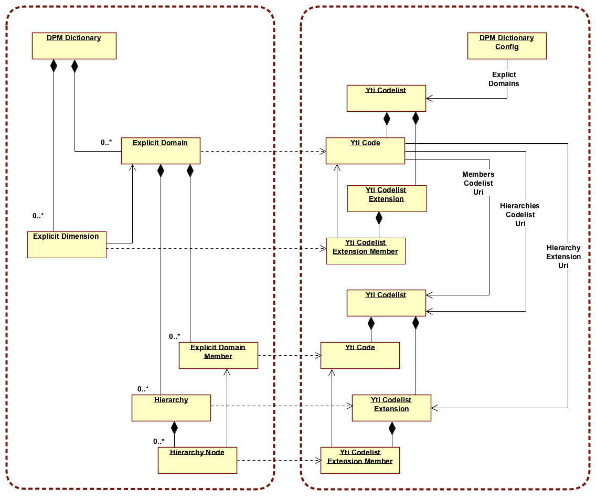

## 1. DPM concepts - Mapping from Yti Reference Data -service

### 1 Metric

#### Structure
Concept                       | Source
----------------------------- | -------------------------------------
Single Metric                 | Yti Codelist Extension Member + Yti Code (Metric Number)
Metrics collection            | Single Yti Codelist Extension (associated as `metrics` in DPM Dictionary Config) listing all Metrics

#### Metric attributes
Attribute                 | Data type   | Value source                                                          | Notes
------------------------- | ----------- | --------------------------------------------------------------------- | -------------------------------------
Domain                    | Association | _Fixed_                                                               | Domain this Member belongs to, fixed association to Explicit Domain with DomainCode `MET`
MemberCode                | String      | _Computed_                                                            | "${DataTypeIdentifier}${PeriodTypeIdentifier}${MetricNumber}"
MemberXBRLCode            | String      | _Computed_                                                            | "${Owner.prefix}_met:${MemberCode}
MemberLabel               | String      | YtiCodelistExtensionMember.prefLabel                                  |
IsDefaultMember           | Boolean     | _Fixed_                                                               | `NULL` for now 
Concept                   | Association | YtiCodelistExtensionMember                                            | Timestamps, validity dates, etc
MetricNumber              | Integer     | YtiCodelistExtensionMember.code.codeValue                             | 
DataType                  | String      | YtiCodelistExtensionMember.memberValue("dpmDataType")                 | Type of data, enumerated text
FlowType                  | String      | YtiCodelistExtensionMember.memberValue("dpmFlowType")                 | The time dynamics of the information, enumerated text
BalanceType               | String      | YtiCodelistExtensionMember.memberValue("dpmBalanceType")              | Balance type, enumerated text
ReferencedDomainCode      | String      | YtiCodelistExtensionMember.memberValue("dpmReferencedDomainCode")     | Associates metric with Domain, from where to obtain allowed values for this Metric
ReferencedHierarchyCode   | String      | YtiCodelistExtensionMember.memberValue("dpmReferencedHierarchyCode")  | Associates metric with Hierarchy, from where to obtain allowed values for this Metric
HierarchyStartingNode     | String      | _Fixed_                                                               | `NULL` for now 
IsStartingMemberIncluded  | Boolean     | _Fixed_                                                               | `NULL` for now

#### Needed changes to Yti Reference Data -Service
- New Yti Codelist Extension & PropertyType for it: `dpmMetric`
- New memberValue PropertyTypes: `dpmDataType`, `dpmFlowType`, `dpmBalanceType`, `dpmReferencedDomainCode`, `dpmReferencedHierarchyCode`


## 2 Explicit Domains, Explicit Dimensions and Hierarchies



### 2.1 Explicit Domain

#### Structure
Concept                             | Source
----------------------------------- | -------------------------------------
Single Explict Domain               | Yti Code
Explict Domains collection          | Single Yti Codelist (associated as `explictDomains` in DPM Dictionary Config) listing all Explicit Domains

#### Explicit Domain attributes
Attribute                     | Data type   | Value source                         | Notes
----------------------------- | ----------- | ------------------------------------ | --------------------------------------
DomainCode                    | String      | YtiCode.codeValue                    |
DomainXBRLCode                | String      | _Computed_                           | "${Owner.prefix}_exp:${DomainCode}" 
DomainLabel                   | String      | YtiCode.prefLabel                    |
DomainDescription             | String      | YtiCode.description                  |
DataType                      | String      | _Fixed_                              | `NULL` for Explicit Domains
IsTypedDomain                 | Boolean     | _Fixed_                              | `FALSE` for Explict Domains
Concept                       | Association | YtiCode                              | Timestamps, validity dates, etc

#### Additional attributes
Attribute                     | Data type   | Value source                                                  | Notes
----------------------------- | ----------- | ------------------------------------------------------------- | -------------------------------------
MembersCodelistUri            | String      | YtiCode.externalReferences("MembersCodelistUri").first()      | Associates all Yti Codes from given Yti Codelist as Members to this Explicit Domain
HierarchiesCodelistUri        | String      | YtiCode.externalReferences("HierarchiesCodelistUri").first()  | Associates all Yti Codelist Extensions from given Yti Codelist as Hierarchies to this Explicit Domain
HierarchyExtenionUris         | String      | YtiCode.externalReferences("HierarchyExtensionUri")           | Associates given Yti Codelist Extensions as Hierarchies to this Explicit Domain
MemberXBRLCodePrefix          | String      | YtiCode.??                                                    | Optional prefix for Member's MemberCodes

#### Needed changes to Yti Reference Data -Service
- New External Reference types: `MembersCodelistUri`, `HierarchiesCodelistUri`, `HierarchyExtensionUri`
- MemberValue support for Yti Codes or similar storage for: `MemberXBRLCodePrefix`


### 2.2 Explict Domain Member

#### Structure mappig
Concept                                         | Source
----------------------------------------------- | -------------------------------------
Single Explict Domain Member                    | Yti Code
Collection of Members for single Explict Domain | Single Yti Codelist associated to the Explict Domain via `MembersCodelistUri`

#### Explict Domain Member attributes
Attribute                     | Data type   | Value source                          | Notes
----------------------------- | ----------- | ------------------------------------- | -------------------------------------
Domain                        | Association | _Structure_                           | Domain this Member belongs to. Derived from `MembersCodelistUri` association.
MemberCode                    | String      | YtiCode.codeValue                     |
MemberXBRLCode                | String      | _Computed_                            | "${Owner.prefix}_${Domain.DomainCode}:${MemberCode}"
MemberLabel                   | String      | YtiCode.prefLabel                     |
IsDefaultMember               | _Computed_  |                                       | (YtiCodelist.defaultCode.codevalue == MemberCode)
Concept                       | Association | YtiCode                               | Timestamps, validity dates, etc


### 2.3 Hierarchy

#### Structure
Concept                                             | Source
--------------------------------------------------- | -------------------------------------
Single Hierarchy                                    | Yti Codelist Extension
Collection of Hierarchies for single Explict Domain | All Yti Codelist Extensions which are associated to Explict Domain via `HierarchiesCodelistUri` or `HierarchyExtenionUris` and which are having PropertyType `definitionHierarchy` or `calculationHierarchy`

#### Hierarchy attributes
Attribute                    | Data type   | Source                               | Notes
---------------------------- | ----------- | ------------------------------------ | ------------------------------------
Domain                       | Association | _Structure_                          | Domain this Hierarchy relates to. Derived from `HierarchiesCodelistUri` and `HierarchyExtenionUris` association.
HierarchyCode                | String      | YtiCodelistExtension.codeValue       |
HierarchyLabel               | String      | YtiCodelistExtension.prefLabel       |
HierarchyDescription         | String      | _Fixed_                              | `NULL` for now
Concept                      | Association | YtiCodelistExtension                 | Timestamps, validity dates, etc


### 2.4 Hierarchy Node

#### Structure
Concept                                  | Source
---------------------------------------- | -------------------------------------
Single Hierarchy Node                    | Yti Codelist Extension Member + Yti Code (Explict Domain Member)
Collection of Nodes for single Hierarchy | All Yti Codelist Extension Members present in Yti Codelist Extension.

#### Hierarchy Node attributes
Attribute            | Data type   | Value source                                                 | Notes
---------------------| ----------- | ------------------------------------------------------------ | -------------------------------------
Hierarchy            | Association | _Structure_                                                  | Hierarchy to which this Node belongs.
Member               | Association | YtiCodelistExtensionMember.code                              | Member this node represents
ParentMember         | String      | YtiCodelistExtensionMember.parentMember().code               | Indicates the parent node, `NULL` for root level nodes
IsAbstract           | Boolean     | _Fixed_                                                      | `FALSE` for now
ComparisonOperator   | String      | YtiCodelistExtensionMember.memberValue("ComparisonOperator") |
UnaryOperator        | String      | YtiCodelistExtensionMember.memberValue("UnaryOperator")      |
Order                | String      | _Computed_                                                   | Computed from the order of Yti Codelist Extension Members appearance in Yti Codelist Extension
Level                | String      | _Computed_                                                   | Computed from the hierarchical structure of Yti Codelist Extension Members in Yti Codelist Extension
Path                 | String      | _Fixed_                                                      | `NULL` for now
Concept              | Association | YtiCodelistExtensionMember                                   | Timestamps, validity dates, etc


### 2.5 Explict Dimension

#### Structure
Concept                               | Source
------------------------------------- | -------------------------------------
Single Explict Dimension              | Yti Codelist Extension Member + Yti Code (Explict Domain)
Complete Explict Dimension collection | Single Yti Codelist Extension listing all Explicit Dimensions

#### Explict Dimension attributes
Attribute                   | Data type   | Value source                                            | Notes
----------------------------| ----------- | ------------------------------------------------------- | -------------------------------------
Domain                      | Association | YtiCodelistExtensionMember.code                         | Explicit Domain from which the allowable values for this Explict Dimension are taken
DimensionCode               | String      | YtiCodelistExtensionMember.memberValue("DimensionCode") |
DimensionXBRLCode           | String      | _Computed_                                              | "${Owner.prefix}_dim:${DimensionCode}"
DimensionLabel              | String      | YtiCodelistExtensionMember.prefLabel                    |
DimensionDescription        | String      | _Fixed_                                                 | `NULL` for now
IsTypedDimension            | Boolean     | _Fixed_                                                 | `FALSE` for Explict Dimension
Concept                     | Association | YtiCodelistExtensionMember                              | Timestamps, validity dates, etc

#### Needed changes to Yti Reference Data -Service
- New Yti Codelist Extension & PropertyType for it: `dpmDimension`
- New memberValue PropertyType: `dpmDimensionCode`


## 3 Typed Domain

### 3.1 Typed Domain

#### Structure
Concept                             | Source
----------------------------------- | -------------------------------------
Single Typed Domain                 | Yti Code
Complete Typed Domains collection   | Single Yti Codelist (associated as `typedDomains` in DPM Dictionary Config) listing all Typed Domains

#### Typed Domain attributes
Attribute                     | Data type   | Value source                         | Notes
----------------------------- | ----------- | ------------------------------------ | --------------------------------------
DomainCode                    | String      | YtiCode.codeValue                    |
DomainXBRLCode                | String      | _Computed_                           | "${Owner.prefix}_typ:${DomainCode}" 
DomainLabel                   | String      | YtiCode.prefLabel                    |
DomainDescription             | String      | YtiCode.description                  |
DataType                      | String      | YtiCode.??                           | 
IsTypedDomain                 | Boolean     | _Fixed_                              | `TRUE` for Typed Domains
Concept                       | Association | YtiCode                              | Timestamps, validity dates, etc

#### Needed changes to Yti Reference Data -Service
- MemberValue support for Yti Codes or similar storage for: `DataType`


### 3.2 Typed Dimension

#### Structure
Concept                               | Source
------------------------------------- | -------------------------------------
Single Typed Dimension                | Yti Codelist Extension Member + Yti Code (Typed Domain)
Complete Typed Dimension collection   | Single Yti Codelist Extension (associated as `typedDimensions` in DPM Dictionary Config) listing all Typed Dimensions

#### Explict Dimension attributes
Attribute                   | Data type   | Value source                                            | Notes
----------------------------| ----------- | ------------------------------------------------------- | -------------------------------------
Domain                      | Association | YtiCodelistExtensionMember.code                         | Typed Domain from which the allowable values for this Typed Dimension are taken
DimensionCode               | String      | YtiCodelistExtensionMember.memberValue("DimensionCode") |
DimensionXBRLCode           | String      | _Computed_                                              | "${Owner.prefix}_dim:${DimensionCode}"
DimensionLabel              | String      | YtiCodelistExtensionMember.prefLabel                    |
DimensionDescription        | String      | _Fixed_                                                 | `NULL` for now
IsTypedDimension            | Boolean     | _Fixed_                                                 | `TRUE` for Typed Dimension
Concept                     | Association | YtiCodelistExtensionMember                              | Timestamps, validity dates, etc

#### Needed changes to Yti Reference Data -Service
- New Yti Codelist Extension & PropertyType for it: `dpmDimension`
- New memberValue PropertyType: `dpmDimensionCode`


## 2. DPM Dictionary Config
```JSON
{
  "dpmDictionaries": [
    {
      "owner": {
        "name": "SBR Sample",
        "namespace": "sbr.example.com",
        "prefix": "s2br",
        "location": "sbr.example.com/aample/location",
        "copyright": "Copyright statement about SBR Sample",
        "languages": [
          "en",
          "fi",
          "sv"
        ],
        "defaultLanguage": "en"
      },
      "metrics":{
          "YtiCodelistExtensionUri": "http://uri.example.com/codelist/..."
      },
       
      "explicitDomainsDimensionsHierarchies":{
          "YtiCodelistUri": "http://uri.example.com/codelist/..."
      },
     
      "typedDomains":{
          "YtiCodelistUri": "http://uri.example.com/codelist/..."
      },
       
      "typedDimensions":{
          "YtiCodelistExtensionUris": "http://uri.example.com/codelist/..."
      }
    }
  ]
}
```
