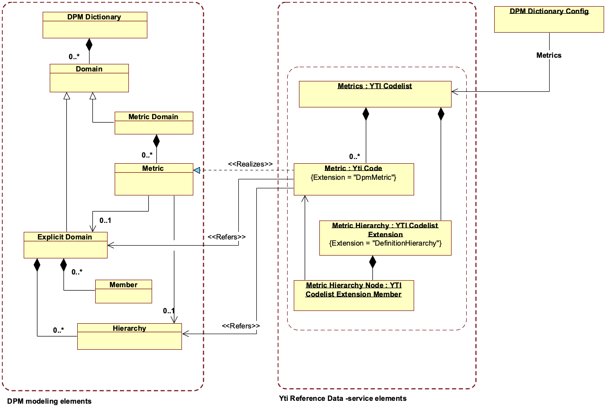
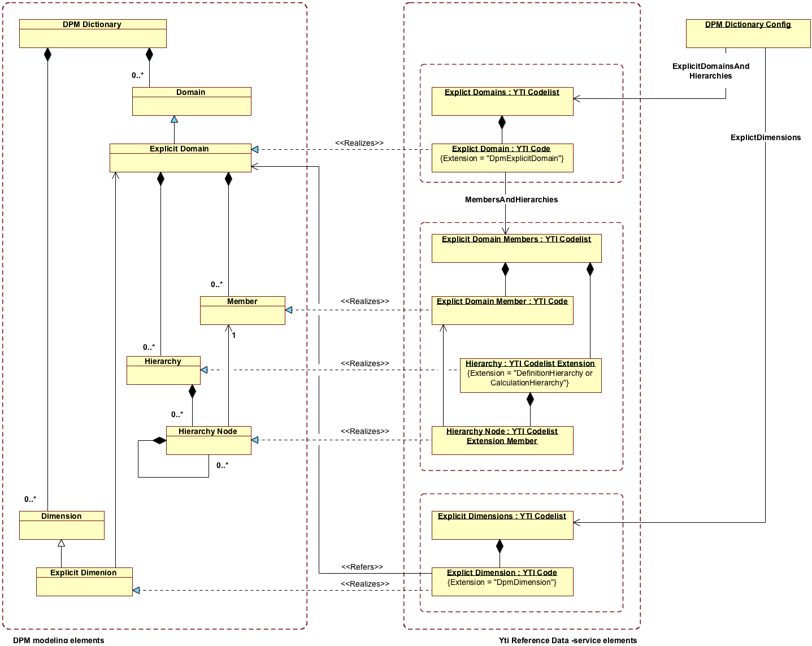
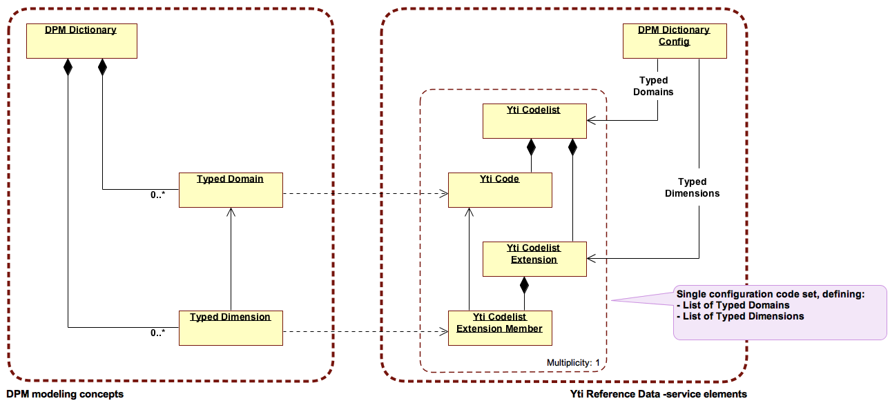

# Mapping of DPM Dictionary concepts to Yti Reference Data -service

This document describes mapping from DPM Dictionary related Data Point Modelling elements to elements available in Yti Reference Data -service. 

> Dictionary defines the classifications used in data description. It does it by
> identifying elements: metrics (that may be arranged in relationship sets), domains and
> their value constraints or members (plus relationships between them) and dimensions.
> -- <cite>EIOPA Data Point Model Documentation</cite>

Mapping is split for clarity to three sections: 
1. DPM metrics
2. DPM "explicit" elements, like Explicit Dimensions, Explicit Domains and Hierarchies
3. DPM "typed" elements, like Typed Dimensions and Typed Domains 

 

## 1 DPM "metrics" concepts

 

### 1.1 Metric Domain

#### Structure
Element                             | Source
----------------------------------- | -------------------------------------
Metrics Explict Domain              | Parent Explict Domain for Metrics (a.k.a `MET` Domain) exists as predefined in DPM models. Thus no need to configure it via YTI. 

#### Explict Domain for Metrics attributes
Attribute                     | Data type   | Value source                                                      | Notes
----------------------------- | ----------- | ----------------------------------------------------------------- | --------------------------------------
DomainCode                    | String      | _Fixed_                                                           | `MET`
DomainXBRLCode                | String      | _Fixed_                                                           | `MET`
DomainLabel                   | String      | _Fixed_                                                           | `Metrics`
DomainDescription             | String      | _Fixed_                                                           | Empty
DataType                      | String      | _Fixed_                                                           | `NULL`
IsTypedDomain                 | Boolean     | _Fixed_                                                           | `FALSE`
Concept.ConceptType           | String      | _Fixed_                                                           | `Domain`
Concept.Owner                 | String      | _Fixed_                                                           | `EuroFiling`
Concept.CreationDate          | Date        | _Fixed_                                                           | `NULL`
Concept.ModificationDate      | Date        | _Fixed_                                                           | `NULL`
Concept.FromDate              | Date        | _Fixed_                                                           | `NULL`
Concept.ToDate                | Date        | _Fixed_                                                           | `NULL`

 

### 1.2 Metric

#### Structure
Element                       | Source
----------------------------- | -------------------------------------
Single Metric                 | Extended Yti Code (extension type: `DpmMetric`)
Complete Metrics collection   | Single Yti Codelist listing all Metrics. Linked as `Metrics` from DPM Dictionary Config.

#### Metric attributes
Attribute                 | Data type   | Value source                                              | Notes
------------------------- | ----------- | --------------------------------------------------------- | -------------------------------------
Domain                    | Association | _Fixed_                                                   | Domain this Member belongs to. Fixed Explicit Domain with code `MET`
MemberCode                | String      | _Derived_                                                 | "${DataType -> Identifier()}${PeriodType -> Identifier()}${MetricNumber}"
MemberXBRLCode            | String      | _Derived_                                                 | "${Owner -> prefix}_met:${MemberCode}
MemberLabel               | String      | YtiCode -> prefLabel                                      |
IsDefaultMember           | Boolean     | _Fixed_                                                   | `NULL` for now 
Concept                   | ValueObject | YtiCode                                                   | Timestamps, validity dates, etc
MetricNumber              | Integer     | YtiCode -> codeValue                                      | TODO: Are MetricNumbers always unique?
DataType                  | String      | YtiCode -> extension(DpmMetric, DpmDataType)              | Type of data, enumerated text
FlowType                  | String      | YtiCode -> extension(DpmMetric, DpmFlowType)              | The time dynamics of the information, enumerated text
BalanceType               | String      | YtiCode -> extension(DpmMetric, DpmBalanceType)           | Balance type, enumerated text
ReferencedDomainCode      | String      | YtiCode -> extension(DpmMetric, DpmReferencedDomain)      | Associates metric with Domain, from where allowed values for this Metric are obtained
ReferencedHierarchyCode   | String      | YtiCode -> extension(DpmMetric, DpmReferencedHierarchy)   | Associates metric with Hierarchy, from where allowed values for this Metric are obtained
HierarchyStartingNode     | String      | _Fixed_                                                   | `NULL` for now 
IsStartingMemberIncluded  | Boolean     | _Fixed_                                                   | `NULL` for now

#### Yti Codelist Extensions
Extension      | Context         | Label EN             | Label FI
-------------- | --------------- | -------------------- | -------------------------------------
DpmMetric      | InlineExtension | DPM Metric           | TODO

 

Extension attribute          | Data type | Label EN              | Label FI  | Allowed values
---------------------------- | --------- | --------------------- | --------- | -------------------------------------
DpmMetricDataType            | String    | Data type             | TODO      | `Enumeration`, `Boolean`, `Date`, `Integer`, `Monetary`, `Percentage`, `String`, `Decimal`, `Lei`, `Isin`
DpmFlowType                  | String    | Flow type             | TODO      | `Instant`, `Duration`
DpmBalanceType               | String    | Balance type          | TODO      | `Credit`, `Debit`
DpmDomainReference           | String    | Domain reference      | TODO      | DomainCode text or blank, no syntax constraints for now
DpmHierarchyReference        | String    | Hierarchy reference   | TODO      | HierarchyCode text or blank, no syntax constraints for now

 

### 1.3 Metric Hierarchy

#### Structure
Element                                             | Source
--------------------------------------------------- | -------------------------------------
Single Metric Hierarchy                             | Yti Codelist Extension (extension type: `DefinitionHierarchy`)
Hierarchies collection for Metric Domain            | All Yti Codelist Extensions in Yti Codelist presenting the Metric Domain.

#### Hierarchy attributes
Attribute                    | Data type   | Source                               | Notes
---------------------------- | ----------- | ------------------------------------ | ------------------------------------
Domain                       | Association |  _Fixed_                             | Domain this Hierarchy relates to. Here fixed to Metric Domain.
HierarchyCode                | String      | YtiCodelistExtension -> codeValue    |
HierarchyLabel               | String      | YtiCodelistExtension -> prefLabel    |
HierarchyDescription         | String      | _Fixed_                              | `NULL` for now
Concept                      | ValueObject | YtiCodelistExtension                 | Timestamps, validity dates, etc

 

### 1.4 Metric Hierarchy Node

#### Structure
Element                                                       | Source
------------------------------------------------------------- | -------------------------------------
Single Metric Hierarchy Node                                  | Yti Codelist Extension Member
Metric Hierarchy Nodes collection for single Metric Hierarchy | All Yti Codelist Extension Members present in Yti Codelist Extension of type `DefinitionHierarchy`

#### Hierarchy Node attributes
Attribute            | Data type   | Value source                                                    | Notes
---------------------| ----------- | --------------------------------------------------------------- | -------------------------------------
Hierarchy            | Association | _Derived_                                                       | Metric Hierarchy to which this Node belongs. Derived from YtiCodelistExtension relation.
Member               | Association | YtiCodelistExtensionMember -> YtiCode                           | Metric / Member this node represents
ParentMember         | Association | YtiCodelistExtensionMember -> hierarchyParent() -> YtiCode      | Parent Member in hierarchy, `NULL` for root level nodes
IsAbstract           | Boolean     | _Fixed_                                                         | `FALSE` for now
Order                | String      | _Derived_                                                       | Computed from the Yti Codelist Extension Members order in Yti Codelist Extension
Level                | String      | _Derived_                                                       | Computed from the Yti Codelist Extension Members hierarchical structure in Yti Codelist Extension
Path                 | String      | _Fixed_                                                         | `NULL` for now
Concept              | ValueObject | YtiCodelistExtensionMember                                      | Timestamps, validity dates, etc

 

## 2 DPM "explicit" concepts

 

### 2.1 Explicit Domain

#### Structure
Element                             | Source
----------------------------------- | -------------------------------------
Single Explict Domain               | Extended Yti Code (extension type: `DpmExplicitDomain`)
Complete Explict Domains collection | Single Yti Codelist listing all Explicit Domains. Linked as `ExplicitDomainsAndHierarchies` from DPM Dictionary Config.

#### Explict Domain attributes
Attribute                     | Data type   | Value source                                                      | Notes
----------------------------- | ----------- | ----------------------------------------------------------------- | --------------------------------------
DomainCode                    | String      | YtiCode -> codeValue                                              |
DomainXBRLCode                | String      | _Derived_                                                         | "${Owner.prefix}_exp:${DomainCode}" 
DomainLabel                   | String      | YtiCode -> prefLabel                                              |
DomainDescription             | String      | YtiCode -> description                                            |
DataType                      | String      | _Fixed_                                                           | `NULL` for Explicit Domains
IsTypedDomain                 | Boolean     | _Fixed_                                                           | `FALSE` for Explict Domains
Concept                       | ValueObject | YtiCode                                                           | Timestamps, validity dates, etc
MembersAndHierarchies         | Association | YtiCode -> subCodeCodelist                                        | Association to Yti Codelist providing Members and Hierarchies for Explicit Domain
MemberXBRLCodePrefix          | String      | YtiCode -> extension(DpmExplicitDomain, DpmMemberXBRLCodePrefix)  | Optional prefix for Explicit Domain's Members XBRL codes

#### Yti Codelist Extensions
Extension         | Context         | Label EN             | Label FI
----------------- | --------------- | -------------------- | -------------------------------------
DpmExplicitDomain | InlineExtension | DPM Explicit Domain  | TODO

 

Extension attribute     | Data type | Label EN                  | Label FI  | Allowed values
----------------------- | --------- | ------------------------- | --------- | -------------------------------------
DpmMemberXBRLCodePrefix | String    | Member XBRL code prefix   | TODO      | Free text or blank, no syntax constraints for now

 

### 2.2 Explict Domain Member

#### Structure
Element                                         | Source
----------------------------------------------- | -------------------------------------
Single Explict Domain Member                    | Yti Code
Members collection for single Explict Domain    | Single Yti Codelist listing Explict Domain's Members. Associated as subCodeCodelist to Explict Domain.

#### Explict Domain Member attributes
Attribute                     | Data type   | Value source                          | Notes
----------------------------- | ----------- | ------------------------------------- | -------------------------------------
Domain                        | Association | _Derived_                             | Domain this Member belongs to. Derived from subCodeCodelist association.
MemberCode                    | String      | YtiCode -> codeValue                  |
MemberXBRLCode                | String      | _Derived_                             | "${Owner.prefix}_${Domain.DomainCode}:${MemberCode}"
MemberLabel                   | String      | YtiCode -> prefLabel                  |
IsDefaultMember               | Boolean     | YtiCodelist -> defaultCode            | 
Concept                       | ValueObject | YtiCode                               | Timestamps, validity dates, etc

 

### 2.3 Hierarchy

#### Structure
Element                                             | Source
--------------------------------------------------- | -------------------------------------
Single Hierarchy                                    | Yti Codelist Extension (extension type: `DefinitionHierarchy` or `CalculationHierarchy`)
Hierarchies collection for single Explict Domain    | All Yti Codelist Extensions in Yti Codelist associated as subCodeCodelist to Explict Domain.

#### Hierarchy attributes
Attribute                    | Data type   | Source                               | Notes
---------------------------- | ----------- | ------------------------------------ | ------------------------------------
Domain                       | Association | _Derived_                            | Domain this Hierarchy relates to. Derived from subCodeCodelist association.
HierarchyCode                | String      | YtiCodelistExtension -> codeValue    |
HierarchyLabel               | String      | YtiCodelistExtension -> prefLabel    |
HierarchyDescription         | String      | _Fixed_                              | `NULL` for now
Concept                      | ValueObject | YtiCodelistExtension                 | Timestamps, validity dates, etc

#### Yti Codelist Extensions
Extension            | Context        | Label EN                | Label FI
-------------------- | -------------- | ----------------------- | -------------------------------------
definitionHierarchy  | Extension      | Definition hierarchy    | Määrityshierarkia
calculationHierarchy | Extension      | Calculation hierarchy   | Laskentahierarkia

 

Extension attribute     | Data type | Label EN              | Label FI                  |  Allowed values
----------------------- | --------- | --------------------- | ------------------------- | -------------------------------------
ComparisonOperator      | String    | Comparison operator   | Vertailuoperaattori       | `=`, `<=`, `>=`
UnaryOperator           | String    | Unary operator        | Aritmeettinen operaattori | `+`, `-`

 

### 2.4 Hierarchy Node

#### Structure
Element                                         | Source
----------------------------------------------- | -------------------------------------
Single Hierarchy Node                           | Yti Codelist Extension Member
Hierarchy Nodes collection for single Hierarchy | All Yti Codelist Extension Members present in Yti Codelist Extension of type `DefinitionHierarchy` or `CalculationHierarchy`

#### Hierarchy Node attributes
Attribute            | Data type   | Value source                                                    | Notes
---------------------| ----------- | --------------------------------------------------------------- | -------------------------------------
Hierarchy            | Association | _Derived_                                                       | Hierarchy to which this Node belongs. Derived from YtiCodelistExtension relation.
Member               | Association | YtiCodelistExtensionMember -> YtiCode                           | Member this node represents
ParentMember         | Association | YtiCodelistExtensionMember -> hierarchyParent() -> YtiCode      | Parent Member in hierarchy, `NULL` for root level nodes
IsAbstract           | Boolean     | _Fixed_                                                         | `FALSE` for now
ComparisonOperator   | String      | YtiCodelistExtensionMember -> memberValue(ComparisonOperator)   |
UnaryOperator        | String      | YtiCodelistExtensionMember -> memberValue(UnaryOperator)        |
Order                | String      | _Derived_                                                       | Computed from the Yti Codelist Extension Members order in Yti Codelist Extension
Level                | String      | _Derived_                                                       | Computed from the Yti Codelist Extension Members hierarchical structure in Yti Codelist Extension
Path                 | String      | _Fixed_                                                         | `NULL` for now
Concept              | ValueObject | YtiCodelistExtensionMember                                      | Timestamps, validity dates, etc

 

### 2.5 Explict Dimension

#### Structure
Element                                 | Source
--------------------------------------- | -------------------------------------
Single Explict Dimension                | Extended Yti Code (extension type: `DpmDimension`)
Complete Explict Dimensions collection  | Single Yti Codelist listing all Explict Dimensions. Linked as `ExplictDimensions` from DPM Dictionary Config.

#### Explict Dimension attributes
Attribute                   | Data type   | Value source                                                | Notes
----------------------------| ----------- | ----------------------------------------------------------- | -------------------------------------
DimensionCode               | String      | YtiCode -> codeValue                                        |
DimensionXBRLCode           | String      | _Derived_                                                   | "${Owner.prefix}_dim:${DimensionCode}"
DimensionLabel              | String      | YtiCode -> prefLabel                                        |
DimensionDescription        | String      | YtiCode -> description                                      | 
IsTypedDimension            | Boolean     | _Fixed_                                                     | `FALSE` for Explict Dimension
Concept                     | ValueObject | YtiCode                                                     | Timestamps, validity dates, etc
Domain                      | Association | YtiCode -> extension(DpmDimension, DpmDomainReference)      | Explicit Domain from which the allowable values for this Explict Dimension are taken

#### Yti Codelist Extensions
Extension            | Context         | Label EN             |  Label FI
-------------------- | --------------- | -------------------- | -------------------------------------
DpmDimension         | InlineExtension | DPM Dimension        | TODO

 

Extension attribute     | Notes             
----------------------- | --------------------------------- 
DpmDomainReference      | Reused from DpmMetric extension

 

## 3 DPM "typed" concepts

 

### 3.1 Typed Domain

#### Structure
Element                             | Source
----------------------------------- | -------------------------------------
Single Typed Domain                 | Extended Yti Code (extension type: `DpmTypedDomain`)
Complete Typed Domains collection   | Single Yti Codelist listing all Typed Domains. Linked as `TypedDomains` from DPM Dictionary Config.

#### Typed Domain attributes
Attribute                     | Data type   | Value source                                      | Notes
----------------------------- | ----------- | ------------------------------------------------- | --------------------------------------
DomainCode                    | String      | YtiCode -> codeValue                              |
DomainXBRLCode                | String      | _Derived_                                         | "${Owner.prefix}_typ:${DomainCode}" 
DomainLabel                   | String      | YtiCode -> prefLabel                              |
DomainDescription             | String      | YtiCode -> description                            |
DataType                      | String      | YtiCode -> extension(DpmTypedDomain, DpmDataType) | TODO: Is value range excatly same as in DpmMetric.DataType?
IsTypedDomain                 | Boolean     | _Fixed_                                           | `TRUE` for Typed Domains
Concept                       | ValueObject | YtiCode                                           | Timestamps, validity dates, etc

#### Yti Codelist Extensions
Extension      | Context         | Label EN             |  Label FI
-------------- | --------------- | -------------------- | -------------------------------------
DpmTypedDomain | InlineExtension | DPM Typed Domain     | TODO

 

Extension attribute     | Data type | Label EN              | Label FI  | Allowed values
----------------------- | --------- | --------------------- | --------- | ----------------------
DpmDomainDataType       | String    | Data type             | TODO      | `Boolean`, `Date`, `Integer`, `Monetary`, `Percentage`, `String`, `Decimal`, `Lei`, `Isin`

 

### 3.2 Typed Dimension

#### Structure
Element                               | Source
------------------------------------- | -------------------------------------
Single Typed Dimension                | Extended Yti Code (extension type: `DpmDimension`)
Complete Typed Dimension collection   | Single Yti Codelist listing all Typed Dimensions. Linked as `TypedDimensions` from DPM Dictionary Config.

#### Attributes
Name                        | Data type   | Value source                                                | Notes
----------------------------| ----------- | ----------------------------------------------------------- | -------------------------------------
DimensionCode               | String      | YtiCode -> codeValue                                        |
DimensionXBRLCode           | String      | _Derived_                                                   | "${Owner.prefix}_dim:${DimensionCode}"
DimensionLabel              | String      | YtiCode -> prefLabel                                        |
DimensionDescription        | String      | YtiCode -> description                                      | 
IsTypedDimension            | Boolean     | _Fixed_                                                     | `TRUE` for Typed Dimension
Concept                     | ValueObject | YtiCode                                                     | Timestamps, validity dates, etc
Domain                      | Association | YtiCode -> extension(DpmDimension, DpmDomainReference)      | Typed Domain from which the allowable values for this Typed Dimension are taken
